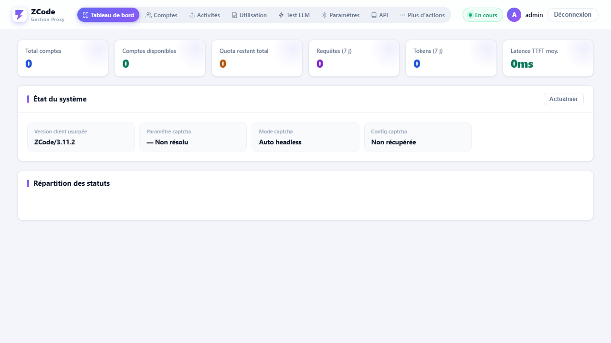
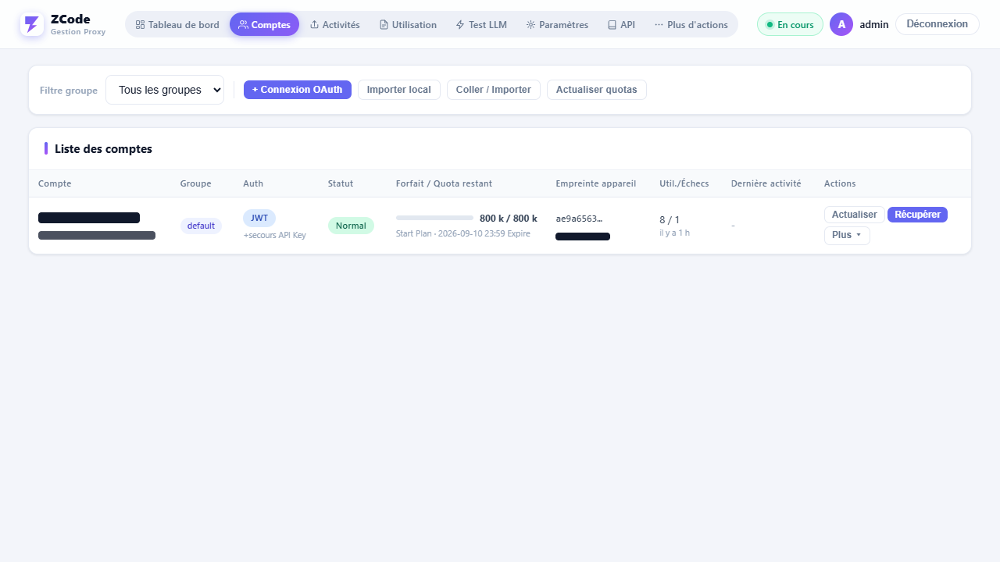
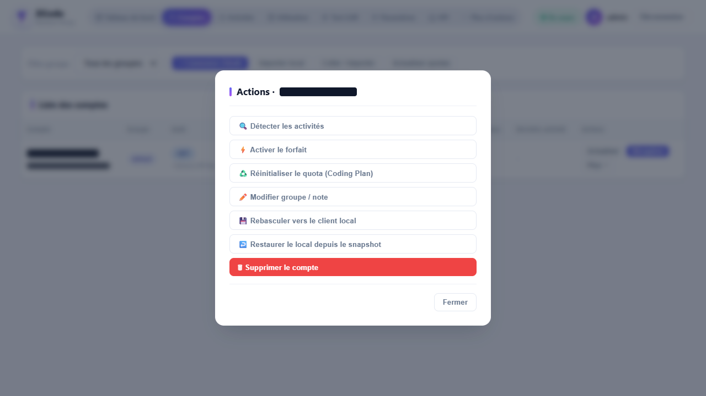
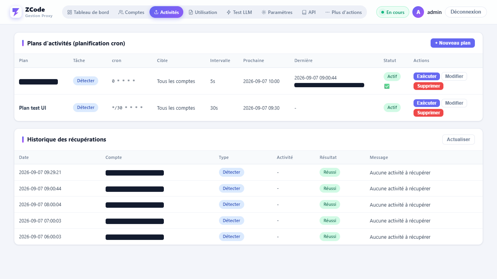
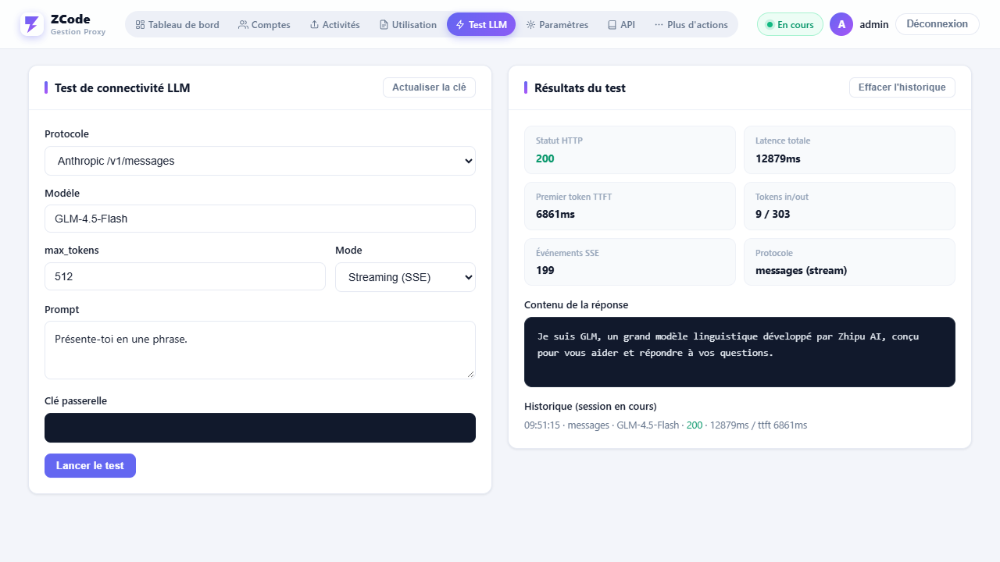

# ZCode Proxy

> **L'outil le plus complet à ce jour pour la gestion multi-comptes ZCode (Z.AI / GLM Coding Plan) et la passerelle 2API.**
> Couverture protocolaire la plus exhaustive (OAuth / canal de quota gratuit / résolution automatique de captcha / récupération des offres promotionnelles / réinitialisation de quota / catalogue de modèles),
> prise en charge complète des trois protocoles 2API (Anthropic Messages + OpenAI Chat + Responses, avec streaming, outils et chaînes de réflexion),
> intégration locale exclusive et approfondie (extraction de l'état de connexion / rebascule en un clic / restauration par instantané / transfert inter-machines via paquet de comptes chiffré),
> ingénierie anti-détection (empreintes utls réparties par hôte + captcha en navigateur réel + persistance de l'empreinte d'appareil + proxys de sortie par groupe),
> déploiement en un seul binaire sans dépendance (UI embarquée + SQLite en pur Go, prêt à l'emploi après copie).

Passerelle **ZCode (Z.AI / GLM Coding Plan) multi-comptes + connexion OAuth + détection et récupération d'offres + compatibilité 2API Anthropic/OpenAI**, implémentée en Go sous forme de binaire unique.

## Pourquoi « le plus complet »

| Dimension | Ce projet | Implémentations similaires courantes |
|---|---|---|
| Couverture protocolaire | OAuth + canal gratuit (captcha) + canal par clé + quota / offres / récupération / activation / **réinitialisation de quota** / catalogue de modèles | Souvent un sous-ensemble de retransmission, sans récupération ni réinitialisation |
| 2API | Trois protocoles Messages / Chat / Responses, conversion bidirectionnelle streaming + appels d'outils + chaînes de réflexion, enregistrement en base de l'usage et du TTFT | Souvent Messages seul ou Chat seul |
| Réserve de comptes | Groupes + trois stratégies + machine à états avec reprise automatique + backoff et nouvelle tentative sur 429 + chaîne de dégradation en cas de contrôle anti-fraude + verrou mutex par compte | Simple rotation, sans machine à états ni backoff |
| Captcha | Résolution automatique en Chrome/Edge réel sans tête → repli manuel avec tête en cas d'échec, mise en cache par groupe de proxys avec réutilisation sous délai de grâce | Saisie manuelle des paramètres ou absence de prise en charge |
| Intégration locale | Extraction de l'état de connexion / rebascule en un clic / restauration par instantané / paquet de comptes chiffré `zcb1:` | Généralement simple collage de jeton (token) |
| Anti-détection | 20+ empreintes utls réparties par hôte (h1/h2) + persistance de l'empreinte d'appareil + proxys de sortie par groupe + test d'IP | Requêtes nues ou UA fixe |
| Observabilité | Tableau de bord / fenêtre de composition du quota / page de test LLM / journaux d'exécution et d'usage / rapports | Souvent sans UI ou simple liste |
| Déploiement | Binaire unique + UI embarquée + SQLite en pur Go, sans CGO ni dépendance externe | Nécessite souvent un runtime Python/Node |

## Projets de référence (remerciements)

La conception protocolaire et passerelle de ce projet reprend et intègre les travaux open source suivants, que nous remercions ici :

- **[liu5269/zcode2api](https://github.com/liu5269/zcode2api)** —— Référence principale de la passerelle 2API Z.AI : points de terminaison amont, en-têtes de requête, liaison au captcha, normalisation des quotas et sémantique de la machine à états s'en inspirent largement ;
- [pjpv/zcode-switch](https://github.com/pjpv/zcode-switch) —— Référence pour la bascule multi-comptes / la récupération d'offres / le chiffrement et déchiffrement des identifiants locaux (Rust) ;
- [vibe-coding-labs/zcode-reverse-engineer](https://github.com/vibe-coding-labs/zcode-reverse-engineer) —— Documentation de rétro-ingénierie protocolaire.

L'interface adopte une disposition de console d'administration avec navigation supérieure en pastilles (pills) + cartes + fenêtres modales.

## Captures d'écran de l'interface

| Tableau de bord | Gestion des comptes |
|---|---|
|  |  |

| Actions de compte (modale) | Tâches promotionnelles |
|---|---|
|  |  |

| Test LLM |
|---|
|  |

## Aperçu des fonctionnalités

| Module | Description |
|---|---|
| Gestion multi-comptes | Import en un clic depuis le client local / connexion OAuth (collage manuel par défaut, bouclage local expérimental) / collage de JWT et de clé API ; groupes, stratégies d'activation (random / round_robin / best_quota), machine à états |
| Passerelle 2API | `/v1/messages` (Anthropic natif), `/v1/chat/completions`, `/v1/responses`, `/v1/models`, `/v1/messages/count_tokens` ; streaming SSE + enregistrement de l'usage et du TTFT |
| Suivi du quota | Actualisation périodique en arrière-plan ; la barre de quota de la page des comptes est **cliquable** pour afficher la composition par emplacement de forfait et par modèle ; pilote la machine à états |
| Système promotionnel | Détection (billing/preview), récupération (billing/claim + captcha invisible Alibaba Cloud), activation (event/report), **réinitialisation du quota Coding Plan** (reset/status · use · opportunity · history/read) ; planification cron + délai anti-contrôle entre comptes |
| Vérification humaine | Pilotage du **vrai Chrome/Edge local** via go-rod pour une résolution sans tête ; bascule automatique vers un mode manuel avec tête en cas d'échec ; paramètres mis en cache par groupe de proxys de sortie |
| Masquage d'empreinte | 20+ ClientHello utls prédéfinis + JA3 personnalisé ; stratégie de transport sélectionnée par hôte |
| Proxys de sortie | Nœuds liés par groupe (SOCKS5 / HTTP CONNECT), nœud par défaut, proxy global, détection du proxy système, sondage de ports, test d'IP de sortie |
| Intégration locale | Import par déchiffrement de `~/.zcode/v2/credentials.json` ; rebascule en un clic (sauvegarde + écriture atomique) ; paquet de comptes chiffré `zcb1:` pour export/import |
| Page de test LLM | Test en ligne trois protocoles × streaming/non-streaming (état / latence / TTFT / tokens / nombre d'événements SSE / contenu / historique) |
| Sécurité | Mot de passe bcrypt + limitation de débit avec backoff exponentiel par IP de connexion ; comparaison en temps constant pour les clés `sk-` ; sessions SameSite=Strict ; les identifiants ne sont jamais journalisés |

## Détail des fonctionnalités

### Extraction locale des comptes (import en un clic de l'état de connexion ZCode local)

Vous n'avez pas besoin de vous reconnecter : extrayez directement les comptes déjà connectés du client ZCode local :

- Lecture de `~/.zcode/v2/credentials.json` (texte chiffré `enc:v1:` AES-256-GCM), déchiffré avec la formule de dérivation de clé identique à celle du client officiel
  (`SHA-256(zcode-credential-fallback:{plateforme}:{home}:{utilisateur})`, remplaçable via `ZCODE_CREDENTIAL_SECRET`) ;
- Extraction de `zcodejwttoken` (JWT Coding Plan, identifiant du canal gratuit), de `oauth:*:access_token` (contenant la déclaration api_key) et de `oauth:*:user_info` (e-mail / surnom / user_id) ;
- Lecture dans `~/.zcode/v2/config.json` de la clé API en clair de `builtin:*-coding-plan` (format complet `{id}.{secret}`) comme identifiant du canal par clé ;
- Lecture du `deviceMid` de `telemetry-state.json` comme empreinte d'appareil ; **sauvegarde simultanée de l'instantané d'identifiants d'origine** (pour restauration ultérieure) ;
- Insertion ou mise à jour en base avec `user_id` comme clé naturelle : une réimportation n'écrase ni l'empreinte d'appareil ni l'instantané ; le quota est actualisé automatiquement après import pour confirmer l'état du forfait.

### Rebascule vers le client local & restauration de compte en un clic

Réécrivez n'importe quel compte de la passerelle vers le client ZCode local pour en faire le compte courant du client :

- **Rebascule** : sauvegarde préalable de `credentials.json` + `config.json` vers `data/backups/` (avec horodatage) → réchiffrement du JWT / access_token / user_info de ce compte en `enc:v1:`,
  mise à jour de l'apiKey start-plan / coding-plan et de l'état activé dans `config.json` → **écriture atomique via fichier temporaire + renommage** → arrêt optionnel du processus `ZCode.exe` pour appliquer les modifications ;
- **Restauration** : annulez la rebascule en un clic grâce à l'instantané d'origine enregistré lors de l'import, et rétablissez l'état de connexion initial du client (à l'octet près) ;
- L'ensemble du processus ne détruit aucune autre option du client (seules les clés liées à l'état de connexion sont remplacées).

### Migration par paquet de comptes chiffré (inter-machines)

- Export : sélectionnez les comptes → définissez un mot de passe → générez une chaîne chiffrée à préfixe `zcb1:` (`base64(salt16‖nonce12‖ct)`, PBKDF2-SHA256 à 120 000 itérations + AES-256-GCM), incluant JWT / clé / empreinte d'appareil / instantané ;
- Import : sur une autre machine, collez la chaîne chiffrée + le mot de passe pour déchiffrer et importer en base ; un mot de passe erroné est rejeté directement, sans écrire de texte en clair sur disque.

### Connexion OAuth (nouveau compte)

- Après initiation, la page d'autorisation Z.AI s'ouvre ; comme ce client public n'a enregistré comme redirection que `https://zcode.z.ai/login`, le **mode de collage manuel est utilisé par défaut** :
  après autorisation, copiez l'URL complète de la barre d'adresse `zcode.z.ai/login?code=…` et collez-la dans la passerelle, qui procède à l'échange et à l'enregistrement (en cas d'échec, le code métier précis s'affiche) ;
- Le mode de bouclage (`127.0.0.1:8687/oauth/callback`) est conservé à titre expérimental (il retourne actuellement `Redirect URI not registered`) ;
- Chaîne d'échange : `code → JWT Coding Plan + access_token` → extraction automatique de la clé API (z/login → customer → api_keys → copy) → complément via userinfo → enregistrement en base + actualisation du quota.

### Détection / récupération / activation d'offres / réinitialisation de quota

- **Détection** : `billing/preview` liste les offres récupérables (plan_id / priorité / détail des droits accordés incluant capabilities et dates d'effet) ;
- **Récupération** : `billing/claim {plan_id}` + en-tête de captcha invisible Alibaba Cloud ; traitement sémantique des codes d'erreur (1003 déjà récupéré considéré comme succès idempotent, 1005 quota journalier épuisé avec lecture de next_at) ;
  un verrou mutex par compte garantit qu'une action manuelle dans l'UI et une tâche cron planifiée ne récupèrent pas en double en cas de concurrence ;
- **Activation** : remontée `event/report` (app_launch + app_daily_active, avec device_mid / user_id) déclenchant l'attribution côté serveur du Start Plan ;
- **Réinitialisation de quota** : `coding-plan/reset/status` interroge les opportunités de réinitialisation five_hour / week → `reset/use {idempotency_key, reset_type}` consomme une opportunité pour restaurer le quota ;
- **Planification** : planifications cron (déduplication à la minute + mutex par plan + délai aléatoire entre comptes pour éviter le contrôle anti-fraude), types de tâches detect / claim / activate / reset, historique d'exécution consultable.

### Suivi du quota et fenêtre de composition

- Actualisation périodique en arrière-plan selon `quota_refresh_interval` (0 = désactivé) ; limitation à 30 s après succès pour éviter les appels en rafale ;
- La barre de quota de la page des comptes est **cliquable** : une fenêtre affiche les emplacements par forfait (plan_id / palier / état / expiration / progression) et le détail par modèle (total / consommé / restant / part / cycle) ;
- Le quota pilote la machine à états : épuisé → exhausted, limitation de débit → cooling, échec d'authentification → invalid (reprise automatique possible après une actualisation authentifiée réussie), sans abonnement → inactive.

### Passerelle 2API et conversion protocolaire

- Trois points d'entrée : Anthropic `/v1/messages`, OpenAI `/v1/chat/completions`, `/v1/responses`, plus `/v1/models` et `/v1/messages/count_tokens` ;
- Conversion bidirectionnelle requête / réponse (mappage complet de system / tool / image / thinking / tool_choice), conversion image par image en streaming SSE avec détection de l'usage et du TTFT enregistrés en base ;
- Les erreurs amont ne sont jamais déguisées en succès : un événement `error` dans le flux et une coupure en cours de flux sont traités comme des échecs (chunk d'erreur pour OpenAI, `response.failed` pour Responses).

### Vérification humaine / empreinte / proxys de sortie

- Captcha : go-rod pilote le vrai Chrome/Edge local pour résoudre sans tête la vérification invisible Alibaba Cloud (profil persisté conservant les cookies anti-fraude), bascule automatique vers un mode manuel avec tête après des échecs consécutifs ; paramètres mis en cache 45 s par groupe de proxys de sortie + délai de grâce de 300 s ;
- Empreinte : 20+ préréglages utls + JA3 personnalisé ; `zcode.z.ai` utilise empreinte + HTTP/1.1 (WAF ESA), `api.z.ai` utilise la bibliothèque standard + HTTP/2 (ALPN h2 uniquement) ;
- Proxys : nœuds liés par groupe (SOCKS5 / HTTP CONNECT) + nœud par défaut + proxy global ; détection du proxy système, sondage des ports locaux, test d'IP de sortie.

### Page de test LLM et sécurité

- Page de test : trois protocoles × streaming / non-streaming, affichage en temps réel de l'état / de la latence totale / du TTFT / des tokens / du nombre d'événements SSE / du contenu de réponse / de l'historique de session ;
- Sécurité : mot de passe d'administration bcrypt + limitation de débit avec backoff exponentiel par IP de connexion ; comparaison en temps constant pour les clés `sk-` ; sessions SameSite=Strict ; identifiants et jetons jamais journalisés ; les routes `/api/*` et `/v1/*` inconnues retournent 404 pour éviter les sondes de détection.

---

# Détails techniques

## 1. Architecture générale

```
                         ┌──────────────────────────────────────────────┐
  Client (Claude/Cursor) │  HTTP mux (auth.Middleware)                  │
    /v1/*  (clé sk-) ───▶│  ├─ handler: messages / chat / responses     │
  Navigateur d'admin     │  ├─ /api/*  REST d'administration (session)  │
    /web, /api/* ───────▶│  └─ /web    SPA embarquée                    │
                         │                                            │
                         │  relay (cœur de retransmission)              │
                         │   ├─ AccountPool.Select (stratégie + filtre  │
                         │   │   par machine à états)                   │
                         │   ├─ Chaîne de dégradation : JWT+captcha →   │
                         │   │   JWT direct → APIKey                    │
                         │   ├─ CaptchaService (rod, cache par proxy)   │
                         │   ├─ ClientForURL (utls|h2 par hôte, pool    │
                         │   │   de connexions en cache)                │
                         │   └─ Détection SSE → usage_records           │
                         │                                            │
                         │  Arrière-plan : boucle d'actualisation des   │
                         │  quotas / planificateur cron                 │
                         │  Stockage : SQLite (WAL, connexion unique    │
                         │  en écriture) embarqué dans le binaire       │
                         └──────────────────────────────────────────────┘
                           │                        │
               zcode.z.ai (WAF ESA, h1+utls)   api.z.ai (h2, lib. standard)
```

Binaire unique = Go + `//go:embed web` + `modernc.org/sqlite` (pur Go, sans CGO). Dépendances : `utls` (empreinte TLS), `go-rod` (captcha), `x/net` (SOCKS5), `x/crypto` (bcrypt/PBKDF2), `google/uuid`.

## 2. Cycle de vie d'une requête `/v1/messages`

1. **Authentification** : `x-api-key` ou `Authorization: Bearer` → comparé à `settings.api_key` en base via `subtle.ConstantTimeCompare`.
2. **Normalisation** : mappage de la casse et des préfixes de noms de modèles (`glm-5.3`→`GLM-5.3`, `bigmodel/x`→ routage provider) ; GLM-5.3 force l'injection de `thinking{type:enabled,budget}` + `reasoning_effort:max` (l'amont interdit de désactiver la réflexion) ; contenu string ponté en `[{type:text}]` ; corps limité à 8 Mo.
3. **Sélection de compte** : `AccountPool.Select(provider, group, skip)` selon la stratégie (curseur round_robin / random / best_quota) avec filtre `enabled && état disponible && identifiant présent` ; les comptes en refroidissement redevenus échus sont automatiquement rééligibles.
4. **Chaîne de dégradation** (par compte) :
   - Chemin 1 `JWT + X-Aliyun-Captcha-Verify-Param` → `zcode.z.ai/.../anthropic/v1/messages` (en cas de rejet du captcha, le cache est invalidé et résolu à nouveau, 3 essais maximum) ;
   - Chemin 2 `JWT direct` (latence nulle lorsque l'amont assouplit ses contrôles) ;
   - Chemin 3 `x-api-key` → `api.z.ai/api/anthropic/v1/messages` (sans captcha).
5. **Classification des erreurs amont** : `401/403→invalid` ; `429→ nouvelle tentative avec backoff dans la requête (respect de Retry-After ≤ 5 s), puis cooling 30 s en cas d'échec persistant` ; `402 / expression de solde insuffisant → exhausted` ; `3012 unusual activity → contrôle anti-fraude, essai des autres chemins, cooling si tout échoue` ; `3xx→cooling (défi WAF)` ; `2xx mais non json/sse → cooling` ; le reste est retransmis tel quel.
6. **Succès** : `MarkUsed` (les états cooling / exhausted reviennent à active) + actualisation limitée du quota (30 s) + transmission / conversion en streaming + détection SSE écrite dans `usage_records` (avec TTFT).
7. **Échec total** : 503 `no_available_account`, avec le cas échéant « reprise automatique dans environ N secondes » et la chaîne des dernières causes d'échec.

## 3. Modèle de concurrence et de verrous

| Verrou / primitive | Emplacement | Sémantique |
|---|---|---|
| `pool.rotation` (mutex) | Curseur de sélection | round_robin incrémenté par `group\|provider` |
| `claimLocks[id]` (mutex par compte, TryLock) | Récupération / réinitialisation | L'UI manuelle et le cron concurrents ne récupèrent / ne réinitialisent pas en double |
| `solveSem` (canal cap-1) | Captcha | Résolution unique globale ; l'actualisation en arrière-plan utilise TryAcquire non bloquant, **sans chemin de fuite de verrou** |
| `execLocks[planId]` (mutex par plan, TryLock) | cron | Les plans longs ne s'accumulent pas en file, le tick sans verrou est ignoré |
| `clientCache` (sync.Map) | Clients HTTP | Clé `(proxy, empreinte, JA3, timeout, est-zcode)` ; toute modification de réglage appelle `CloseIdleClients()` |
| SQLite `MaxOpenConns(1)` + WAL | Stockage | Écritures sérialisées uniques, busy_timeout 5 s |

## 4. Schéma de base de données (SQLite, WAL)

| Table | Colonnes clés | Usage |
|---|---|---|
| `accounts` | `user_id` (clé naturelle, UNIQUE), `auth_type`, `zcode_jwt`, `api_key`, `access_token`, `device_mid`, `creds_raw`, `status`, `enabled`, `account_group`, `quota_json`, `plan_tier/expire`, `total/used/remaining`, `cooling_until`, `use/fail_count` | Comptes + identifiants + instantané de quota ; l'upsert utilise `COALESCE(NULLIF(excluded.x,''), x)` pour préserver device_mid / creds_raw |
| `settings` | KV | Stratégie / intervalle d'actualisation / proxy / empreinte / mode captcha / liste de modèles / hash de mot de passe / api_key |
| `claim_plans` | cron_expr, task_type (detect/claim/activate/reset), target_type, delay_seconds, last_run_* | Plans d'offres / de réinitialisation |
| `claim_records` | account_id, task_type, plan_id, success, code, next_at | Historique de détection / récupération / réinitialisation |
| `usage_records` | account_id, model, tokens in/out/total, stream, status_code, duration_ms, ttft_ms | Usage et latence |
| `proxy_nodes` | type/host/port/auth, is_default, group_name, check_* | Proxys de sortie par groupe |
| `plan_run_records` | plan_id, status, success/fail_count, duration_ms | Historique d'exécution des plans |

## 5. Détails du protocole amont

### 5.1 Points de terminaison

| Usage | Point de terminaison | Authentification |
|---|---|---|
| Messages (canal gratuit) | `POST zcode.z.ai/api/v1/zcode-plan/anthropic/v1/messages` | Bearer JWT + en-tête captcha |
| Messages (canal par clé) | `POST api.z.ai/api/anthropic/v1/messages` | `x-api-key` |
| Quota | `GET zcode.z.ai/api/v1/zcode-plan/billing/current\|balance?app_version=` | Bearer JWT |
| Quota du canal par clé | `GET api.z.ai/api/monitor/usage/quota/limit` + `/api/biz/subscription/list` | Bearer key |
| Aperçu des offres | `GET zcode.z.ai/api/v1/zcode-plan/billing/preview?app_version&platform` | Bearer JWT |
| Récupération | `POST zcode.z.ai/api/v1/zcode-plan/billing/claim` `{plan_id}` | Bearer JWT + en-tête captcha |
| Activation | `POST zcode.z.ai/api/v1/event/report` (app_launch + app_daily_active) | Bearer JWT |
| Réinitialisation de quota | `GET/POST zcode.z.ai/api/v1/coding-plan/reset/{status,use,opportunity,history/read}` | Bearer JWT + `X-Bigmodel-Authorization` + `Bigmodel-Target-Type` |
| OAuth | `chat.z.ai/api/oauth/authorize` → `zcode.z.ai/api/v1/oauth/token` → `api.z.ai/api/auth/z/login` → `biz/customer/getCustomerInfo` → `biz/v1/organization/{org}/projects/{proj}/api_keys` → `.../copy/{key}` | — |
| Configuration captcha | `GET zcode.z.ai/api/v1/client/configs?version&os` → `data.configs.captcha{enabled,prefix,region,sceneId}` | — |
| Catalogue de modèles | Idem → `data.builtinModels[] / providers[]` | — |

### 5.2 En-têtes de requête (conformes au client officiel)

En-têtes d'identité : `User-Agent: ZCode/{ver}`, `X-ZCode-App-Version`, `X-Title: Z Code@electron`, `X-Platform: win32-x64`, `X-Release-Channel: stable`, `X-Client-Language` (locale Intl), `X-Client-Timezone` (tz Intl), `X-Os-Category` (win32→windows), `X-Os-Version` (10.0.build), `X-Device-Mid` (telemetry-state.json), `x-request-id` (uuid).
Canal de messages en supplément : `anthropic-version: 2023-06-01`, `X-ZCode-Agent: glm`, `HTTP-Referer: https://zcode.z.ai`, `X-Aliyun-Captcha-Verify-Param` (+Region).

### 5.3 Sémantique des codes d'erreur

| code | Signification | Action de la passerelle |
|---|---|---|
| 1001/1002 | Forfait inexistant / offre terminée | Message d'information |
| 1003 | Déjà récupéré | Considéré comme succès à vide (idempotent) |
| 1004 | Conditions non remplies | Message d'information |
| 1005 | Quota journalier épuisé | Lecture de `data.plan.ends_at` → next_at |
| 3001 / 3007 | Paramètre erroné / échec captcha | Nouvelle résolution du captcha puis nouvelle tentative |
| 3101 | coding plan is required | Seuil de réinitialisation non atteint |
| 3301 | Opportunité de réinitialisation accordée | Succès |
| HTTP 3012 | unusual activity (contrôle anti-fraude) | Essai des autres chemins, cooling si tout échoue |
| HTTP 429 | Limitation de débit | Backoff puis cooling 30 s |

## 6. SSE / conversion protocolaire

- **Anthropic→OpenAI chat** : `message_start→ premier chunk (role)`, `content_block_delta.text_delta→delta.content`, `thinking_delta→delta.reasoning_content`, `tool_use→delta.tool_calls[index]`, `message_delta→finish_reason`, chunk final `usage (include_usage)` + `[DONE]`.
- **Anthropic→Responses** : `response.created / output_item.added / content_part.added / output_text.delta / function_call_arguments.delta / output_text.done / output_item.done / response.completed` ; en cas d'erreur / de coupure, émission de `response.failed`.
- **OpenAI→Anthropic (requête)** : system / developer → chaîne `system` ; tool→`tool_result` ; assistant.tool_calls→`tool_use` ; image_url (data:)→ image base64 ; mappage de tool_choice auto / required / name.
- **Responses→Anthropic** : instructions→system ; mappage des message / function_call / function_call_output de input[] ; reasoning.effort→reasoning_effort.
- **Robustesse** : tampon d'analyse SSE plafonné à 16 Mo, tolérance aux trames fragmentées entre chunks en LF / CRLF ; `event:error` et `err!=io.EOF` sont tous deux traités comme des échecs (jamais déguisés en succès).

## 7. Sous-système de captcha (Alibaba Cloud invisible)

- Configuration : `client/configs` → `{enabled,prefix,region,sceneId}`, mise en cache 10 min.
- Résolution : rod démarre le **vrai Chrome/Edge local** (le Chromium embarqué est détecté par le contrôle anti-fraude), visite préalable de `zcode.z.ai` pour établir le même contexte d'origine, injection du HTML du SDK (valeurs de configuration échappées en JSON pour prévenir toute injection), `startTracelessVerification` → capture du param via le rappel `__onCaptcha` ; user-data-dir persisté conservant les cookies anti-fraude.
- Mise en cache : par **proxy de sortie**, TTL 45 s ; après expiration, délai de grâce de 300 s avec retour de l'ancienne valeur et actualisation en arrière-plan ; mise en cache des échecs 60 s pour éviter les tempêtes ; après 2 échecs consécutifs sans tête, passage au mode manuel avec tête.
- Contrôle anti-fraude : les IP de centres de données déclenchent F001 ; les paramètres sont valables une seule fois / brièvement, tout rejet entraîne invalidation et nouvelle résolution.

## 8. Empreinte TLS et stratégie de transport

- Pile officielle : Electron 41 / Chromium 146 (BoringSSL, TLS 1.3, courbes PQ X25519MLKEM768=4588, ECH=65037, ALPS=17613).
- Constat : le WAF ESA de zcode.z.ai **n'applique pas de liste blanche JA3 stricte** (stdlib / utls / navigateurs autorisés), le contrôle repose sur le comportement / le captcha / la fréquence ; api.z.ai **ALPN h2 uniquement**.
- Stratégie : `zcode.z.ai` → préréglage utls (famille Chrome par défaut) + **HTTP/1.1** ; le reste → bibliothèque standard + **HTTP/2** ; clients mis en cache par `(proxy, empreinte, JA3, timeout, hôte)`.
- JA3 personnalisé : 5 segments (version, suites, extensions, courbes, formats de points) → `utls.ClientHelloSpec` ; prévalidation côté serveur sur la page des réglages.

## 9. Identifiants locaux et rebascule

- `~/.zcode/v2/credentials.json` : `enc:v1:` + b64url (nonce12) . b64url (tag16) . b64url (ct), AES-256-GCM ; clé = SHA-256 (`zcode-credential-fallback:{win32}:{home}:{user}`) ou `ZCODE_CREDENTIAL_SECRET`. Compatibilité octet par octet avec les implémentations officielle / de référence (y compris vecteurs de test inter-langages).
- Rebascule : sauvegarde de `credentials.json` + `config.json` vers `data/backups/` → réécriture chiffrée (fichier temporaire + renommage atomique) → arrêt optionnel de ZCode.exe ; la restauration par instantané permet d'annuler l'opération.
- Paquet de comptes : `zcb1:` + base64 (salt16‖nonce12‖ct), PBKDF2-SHA256 120 000 itérations + AES-256-GCM.

## 10. Référence de configuration

`config/config.json` (généré au premier démarrage) : `listen_addr`, `app_version` (vide = détection via le registre), `models[]`, `upstream{zai,zai_fallback,bigmodel}`.
`settings` (interface / `PUT /api/settings`) : `selection_strategy`, `quota_refresh_interval` (0 = désactivé), `upstream_proxy`, `fingerprint`, `custom_ja3`, `captcha_mode` (auto / manual / off), `gateway_models`, `api_key`, `password_hash` (bcrypt).

## 11. API d'administration (extrait, authentification par session)

`/api/login|logout|auth/check|auth/password` ; `/api/dashboard` ; `/api/accounts` (GET/PUT/DELETE) + `/import/local|paste|bundle` + `/export` + `/{id}/refresh|claim|detect|activate|reset|reset-status|switch-back|restore-local` ; `/api/groups` ; `/api/plans` (CRUD + `/{id}/run`) + `/plan-runs` + `/claim-records` ; `/api/usage-records` + `/stats` ; `/api/settings` + `/settings/api-key[/generate]` ; `/api/proxies` (CRUD + `/{id}/test` + `/test-url` + `/system` + `/probe-ports`) ; `/api/captcha/status|invalidate|solve` ; `/api/fingerprints` ; `/api/models[/sync|/catalog]` ; `/api/accounts/oauth/start|manual|status`.

## 12. Compilation / déploiement / tests

```bash
go build -o zcode-proxy.exe .   # Pur Go sans CGO
./zcode-proxy.exe -config config -db data/zcode.db
go test .                        # Aller-retour enc:v1 + vecteurs inter-langages (ignorés automatiquement si vecteurs absents)
go vet .
```

## 13. Limitations connues

- utls v1.8.2 ne peut pas exprimer la courbe PQ 4588 ni le nouvel identifiant ALPS (17613), le key_share du JA3 personnalisé reste limité à X25519 ;
- L'URI de bouclage OAuth n'est pas enregistrée auprès de Z.AI (`Redirect URI not registered`), le mode de collage manuel est donc utilisé par défaut ;
- Avec plusieurs proxys de sortie, les paramètres captcha sont mis en cache par groupe de proxys et ne sont pas partagés entre groupes ;
- `/v1/messages/count_tokens` fournit une estimation prudente (caractères / 4 + surcharge).

## Limites du dépôt et des données

`data/` (SQLite / sauvegardes / profil navigateur), `*.log`, `*.exe`, `config/config.json` et `refs/` sont couverts par `.gitignore` et **ne seront jamais committés** ; `data/` contient de véritables identifiants de comptes, veuillez ne pas les diffuser. Après clonage, la configuration et une base vide sont générées automatiquement au premier démarrage.

## Mentions légales

1. **Objectif d'apprentissage et d'échange** : ce projet est destiné exclusivement à un usage personnel d'apprentissage, de recherche et d'échange technique, afin de vous aider à comprendre les principes génériques du flux d'autorisation OAuth, de la conception de passerelle API, des empreintes TLS et du stockage des identifiants clients ; **tout usage commercial lucratif, toute revente de service ou tout usage illégal sous quelque forme que ce soit est interdit**.
2. **Respect des conditions de service** : en utilisant ce projet, vous vous engagez à respecter les conditions de service, les accords utilisateurs et les lois et règlements applicables de Z.AI / ZCode ; ce projet n'encourage ni ne facilite aucun manquement aux conditions de service (y compris, sans s'y limiter, l'abus des quotas gratuits, le contournement des offres payantes, les inscriptions en masse ou la sous-location de comptes).
3. **Usage à vos risques** : les conséquences liées à l'utilisation de ce projet — limitation de débit (429), blocage anti-fraude (3012), gel de forfait, bannissement de compte, perte de quota — restent à votre seule charge ; l'auteur n'offre aucune compensation ni garantie de rétablissement.
4. **Sécurité des identifiants à votre charge** : ce projet stocke localement des identifiants de comptes (JWT / clés API / instantanés d'identifiants). Il vous appartient de protéger votre machine, le répertoire `data/`, les paquets de comptes chiffrés et la clé `sk-` de la passerelle ; l'auteur décline toute responsabilité en cas de fuite d'identifiants, d'utilisation détournée ou de préjudice patrimonial résultant d'une conservation négligente.
5. **Sans garantie** : ce projet est fourni « en l'état », sans garantie expresse ou implicite d'aucune sorte (y compris disponibilité, stabilité, exactitude ou absence de contrefaçon) ; les interfaces amont peuvent évoluer, être limitées ou retirées à tout moment, et ce projet n'en garantit pas la disponibilité continue.
6. **Usage conforme des réseaux et proxys** : vous devez vous assurer de la licéité de vos proxys de sortie et de votre environnement réseau ; toute responsabilité légale découlant de vos comportements réseau ou de vos proxys vous incombe.
7. **Traitement des atteintes** : si le contenu de ce projet porte atteinte à vos droits légitimes (y compris marque ou droits d'auteur), veuillez contacter l'auteur, qui supprimera les contenus concernés dès vérification.
8. **Droit applicable** : tout litige né de l'utilisation de ce projet est soumis aux lois et règlements de votre lieu de résidence ; toute poursuite de l'utilisation vaut acceptation de l'intégralité des présentes mentions.

> En résumé : **réservé à l'apprentissage et à l'échange, tout usage commercial ou illégal est interdit ; les risques liés aux comptes et aux identifiants vous incombent ; aucune compatibilité durable n'est garantie face aux évolutions des règles amont.**
